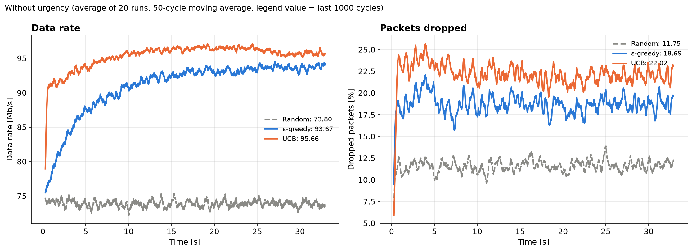
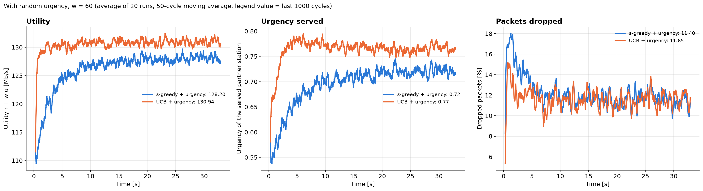
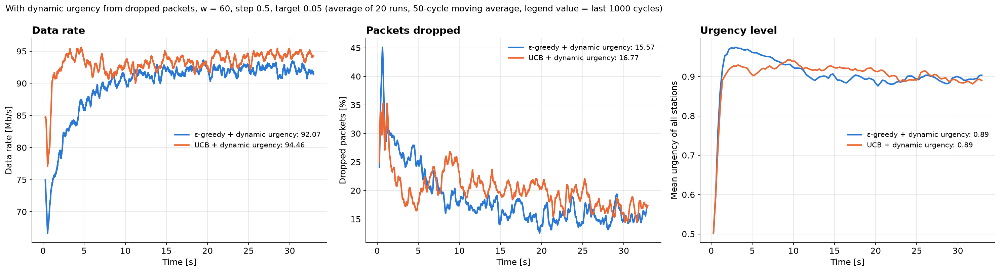

# IEEE 802.11bn Multi-AP Coordinated Spatial Reuse Simulator

A simulator for multi-AP coordinated spatial reuse (C-SR) in IEEE 802.11bn (Wi-Fi 8). In every TXOP a random sharing AP serves one of its stations, and a two-level hierarchical multi-armed bandit chooses the shared AP (level 1) and its station (level 2) that transmit at the same time.

## Methods

| Group | Methods |
|---|---|
| No urgency | Random, ε-greedy, UCB |
| Random urgency | ε-greedy + urgency, UCB + urgency |
| Dynamic urgency | ε-greedy + dynamic urgency, UCB + dynamic urgency |

With urgency, the selection index is `Q + w·u` (plus the UCB bonus for UCB), and the sharing AP serves its most urgent station. The bandits learn only from the data rate.

Dynamic urgency tracks packets. Packets arrive at every station, failed frames are retried up to `MAX_RETRIES` times, and packets older than `PACKET_DEADLINE` cycles are dropped. A station's urgency is held for `URGENCY_HOLD` cycles and then updated as

```
u = clip(u + DROP_STEP * (drop_ratio - TARGET_DROP), 0, 1)
```

where `drop_ratio` is the fraction of the station's arriving packets that were dropped in that period.

## Usage

```
pip install -r requirements.txt
python live.py            # live animation with sliders
python live.py --graphs   # writes the three graphs below
```

The topology, radio model and all parameters are set at the top of `live.py`.

## Graphs




